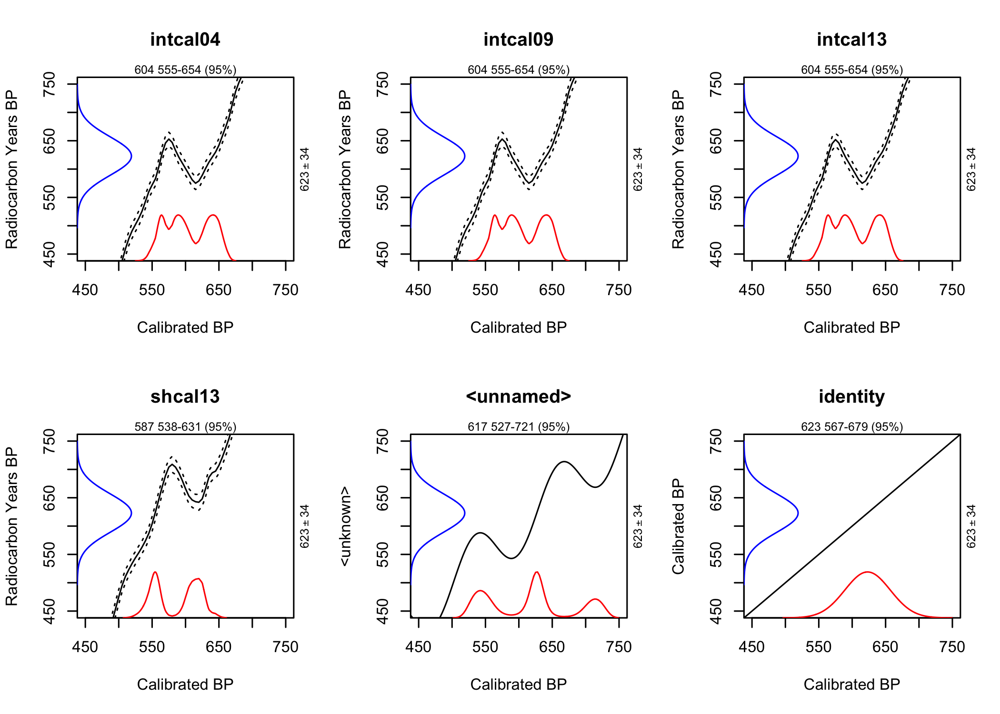

<!-- README.md is generated from README.Rmd. Please edit that file -->
carbon14
========

The goal of carbon14 is to provide a tidy interface to radiocarbon dating, to promote its inclusion in reproducible manuscripts.

Installation
------------

You can install carbon14 from github with:

``` r
# install.packages("devtools")
devtools::install_github("paleolimbot/carbon14")
```

Example
-------

Radiocarbon ages from [Long Lake, Nova Scotia, Canada](http://www.facetsjournal.com/doi/10.1139/facets-2017-0004):

    #> # A tibble: 5 x 4
    #>   sample_id       depth age_14C age_error
    #>   <chr>           <dbl>   <dbl>     <dbl>
    #> 1 LL082011-C2-39  94.0     9148      49.0
    #> 2 UOC-0844        70.5     8582      28.0
    #> 3 LL082011-C2-87  46.0     4396      55.0
    #> 4 UOC-0845        37.5      575      18.0
    #> 5 LL082011-C2-124  9.00     623      34.0

Calibrating dates using `calibrate()`:

``` r
result <- dates %>%
  calibrate(
    measured_age = age_14C, 
    measured_age_error = age_error,
    name = sample_id
  )
result
#> # A tibble: 5 x 9
#>   name   measured_age measured_age_err…    df curve   cal_age   curve_name
#>   <chr>         <dbl>             <dbl> <dbl> <S3: a> <S3: cdi> <chr>     
#> 1 LL082…         9148              49.0   Inf <age_c… 10318.48… intcal13  
#> 2 UOC-0…         8582              28.0   Inf <age_c… 9539.570… intcal13  
#> 3 LL082…         4396              55.0   Inf <age_c… 5005.665… intcal13  
#> 4 UOC-0…          575              18.0   Inf <age_c… 591.8846… intcal13  
#> 5 LL082…          623              34.0   Inf <age_c… 604.1533… intcal13  
#> # ... with 2 more variables: measured_age_type <chr>, cal_age_type <chr>
```

The result is a tibble, which also has a plot method to examine the results:

``` r
plot(result)
```


And a summary of the ages can be generated using `summary()` on the `cal_age` column of the output:

``` r
summary(result$cal_age)
#> # A tibble: 5 x 8
#>   .name       weighted_mean quantile_5 quantile_25 quantile_50 quantile_75
#>   <chr>               <dbl>      <dbl>       <dbl>       <dbl>       <dbl>
#> 1 LL082011-C…         10318      10237       10263       10305       10362
#> 2 UOC-0844             9540       9528        9535        9539        9543
#> 3 LL082011-C…          5006       4870        4917        4975        5040
#> 4 UOC-0845              592        544         553         607         618
#> 5 LL082011-C…           604        555         575         599         635
#> # ... with 2 more variables: quantile_95 <dbl>, dist <chr>
```

Calibration Curves
------------------

The default calibration curve for `calibrate()` is [Intcal13](http://www.radiocarbon.org/IntCal13.htm), but others are also incluced in this package (see `?intcal13`). The curve can be changed using the curve argument, which doesn't have to be the same for each element (it can be a list of actual curves, or a list of object names). To read in another curve, you can use the `read_14c()` function, which will read a `.14c` file from a path or URL.

``` r
read_14c("http://www.radiocarbon.org/IntCal13%20files/intcal13.14c")
#> <age_calibration_curve: 'intcal13'>
#> cal_age = cal_bp, measured_age = age_14C, measured_age_error = error
#> Radiocarbon Years BP => Calibrated BP
#> 
#> # A tibble: 5,141 x 5
#>    cal_bp age_14C error delta_14C sigma
#>     <dbl>   <dbl> <dbl>     <dbl> <dbl>
#>  1  50000   46401   274       313  44.8
#>  2  49980   46381   273       313  44.6
#>  3  49960   46362   271       313  44.3
#>  4  49940   46343   270       313  44.1
#>  5  49920   46324   269       313  44.0
#>  6  49900   46305   268       313  43.8
#>  7  49880   46286   267       312  43.6
#>  8  49860   46267   267       312  43.6
#>  9  49840   46249   266       312  43.5
#> 10  49820   46230   266       312  43.4
#> # ... with 5,131 more rows
```

Finally there is the `null_calibration_curve()`, which keeps dates as they are (e.g., pre-calibrated dates), and a calibration curve of your own design using `calibration_curve()`.

``` r
custom_curve <- calibration_curve(
  cal_age = 0:10000,
  measured_age = cal_age + 50 * sin(cal_age / 20)
)

curve_result <- calibrate(
  measured_age = 623, 
  measured_age_error = 34,
  curve = list(
    intcal04, intcal09, intcal13,
    shcal13, custom_curve, NULL
  )
)

plot(curve_result, ylim = c(450, 750), xlim = c(450, 750))
```


